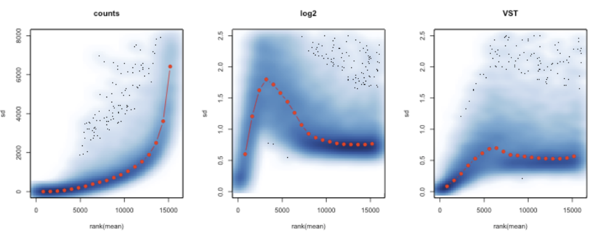

```{r setup, include=FALSE}
knitr::opts_chunk$set(echo = TRUE)
```

## Intro

For this part of the lab we are looking at RNAseq data from mice tumors treated with different kinase inhibitors. Each  (A-F) is tested on several mice and the tumor response is recorded (i.e. did the tumor continue to grow above a certain threshold or not). The response are binary classified as "responder" and "Non_responder". 

## General workflow

This is a general pipeline for an scRNA-seq analysis workflow


In this lab, we will once again omit several steps and start with a count matrix of transcripts, after alignment and mapping has been carried out. 

## Loading packages

The following packages should be loaded. Remember, if you haven't installed a specific package, use `BiocManager::install("packageName")`. When running this, you often get asked "Update all/some/none? [a/s/n]:" In general, it's ok to skip updating the rest of the packages for this lab (which can otherwise take some time)

```{r, message=FALSE, warning=FALSE}
library(SummarizedExperiment)
library(DESeq2)
library(pheatmap)
library(ggplot2)
library(RColorBrewer)
```

## Load data


```{r, echo=F}

counts <- as.matrix(read.table("data/RNAseq_mouse_ensembl_rawCounts.csv", 
                     sep="\t", 
                     row.names = 1,
                     stringsAsFactors = F,
                     header = T))

#FAcit
grep <- grepl(colnames(counts), pattern="Control*")
counts <- counts[, !grep]

treatment <- sapply(strsplit(colnames(counts), "_"), "[[", 2)
outcome <- sapply(strsplit(colnames(counts), "_"), "[[", 3)
sampleID <- sapply(strsplit(colnames(counts), "_"), "[[", 4)
metadata <- as.data.frame(cbind(cbind(treatment, outcome), sampleID))
```

### Create a SummarizedExpermient object with the loaded counts

See `?SummarizedExperiment` to see how to add meta data as a parameter to the function call. 

```{r}
#FACIT
se <- SummarizedExperiment(assays=list(counts=counts), colData=metadata)

```

The resulting object should look like this:

```{r, eval=TRUE, echo=FALSE}
#FACIT
se

```

In order to extract the metadata you type e.g. `se$treatment`
In order to extract the count data, you type `assays(se)$counts`

## Pre-processing 

Testing for differential expression for many genes simultaneously adds to the multiple testing burden, reducing the power to detect DE genes.

Therefore, we filter out genes with all zero or low counts that does not add anything in terms of evidence for differential expression. 

Perform filtering, exude all genes that have a total count value across all samples of <=10.

```{r}
#FACIT
keep <- rowSums(se@assays$data$counts) >= 10
se <- se[keep,]
```

print your summarizedExperiment

```{r}

#FACIT
se

```

We will use DESeq2 for DE analysis. 

Since tools for differential expression analysis are comparing the counts between sample groups for the same gene, gene length does *not* need to be accounted for by the tool. However, sequencing depth and RNA composition *do need* to be taken into account.

To normalize for sequencing depth and RNA composition, DESeq2 uses the median of ratios method. On the user-end there is only one step, but on the back-end there are multiple steps involved, as described below.

Lets look at the read counts for our samples and see the effect of normalization.

Count data is not normally distributed, so if we want to examine the distributions of the raw counts we need to log the counts. Next we’ll use box plots to check the distribution of the read counts on the log2 scale.

```{r}

f <- assays(se)$counts
colnames(f) <- se$sampleID
boxplot(log2(f + 0.5), ylab = "log (base 2) read counts + 0.5")

```


Q - What is your interpretation from the plot?


```{r}
# There are some small variablitity in sequencing depth, but not really that large to use normalized data
```

Now, to use the DESeq2 strategy for normalization, we first need to create a DESeq2 object to store our data. (Similar to our SummarizedExperiment). The code to do this is given below:


```{r, warning=FALSE, message=FALSE}

#Create the DESeqDataSet (set design = ~1, which we change later)
dds <- DESeqDataSetFromMatrix(countData = assays(se)$counts, colData = metadata, design = ~ 1)

#Combine factors of interest into a single factor with all combinations of the original factors
dds$group <- factor(paste0(dds$treatment, dds$outcome))
design(dds) <- ~ group

```

Now, we can use the DESeq2 function `DESeq`. This is a function that performs several steps, including normalization. The theory behind the model is explained [here](http://bioconductor.org/packages/devel/bioc/vignettes/DESeq2/inst/doc/DESeq2.html#theory)

```{r, message=FALSE, warning=FALSE}

dds <- DESeq(dds)

```

if you now print the dds object, you will see that the structure is similar to the SummarizedExperiment, but with some new assays and colData. 

```{r}
#FACIT
dds
```

for each sample, we now have a sizefactor (stored in colData). We can use this sizefactor to normalize our samples by dividing the raw count with the size factor. This is stored in `counts(dds, normalized=T)`

Make a similar boxplot as before, on the normalized data. 

```{r}
#FACIT
norm.counts <- counts(dds, normalized=T)
colnames(norm.counts) <- dds$sampleID
boxplot(log2(norm.counts + 0.5), ylab = "log (base 2) read counts + 0.5")
```


Do you spot the difference?


## Exploratory

When exploring RNAseq data, you usually want to perform some kind of transformation before visualization. Otherwise, highly expressed genes tend to dominate the result. 
A common method to deal with this is to simply take the log2 of the counts. 
However, this can lead to the opposite situation - lowly expressed genes getting to much influence on the result. Another frequently used method is the variance-stabilizing transformation (VST). VST is included in the DESeq2 package. 

In RNA-Seq data, genes with larger average expression have on average larger observed variances across samples. This is called "heteroscedasticity". If we VST transform the data, the standard deviation becomes more constant along the whole dynamic range. 

The following picture illustrate this:



Lets transform our data via the vst method before looking at our samples:

```{r}

vst <- vst(dds, blind=FALSE)


```


### Heatmap

Using the vst transformed counts, we can create a heatmap:

```{r}

sampleDists <- dist(t(assay(vst)))
library("RColorBrewer")
sampleDistMatrix <- as.matrix(sampleDists)
rownames(sampleDistMatrix) <- paste(vst$treatment, vst$outcome, vst$sampleID, sep="-")
colnames(sampleDistMatrix) <- NULL
colors <- colorRampPalette( rev(brewer.pal(9, "Blues")) )(255)
pheatmap(sampleDistMatrix,
         clustering_distance_rows=sampleDists,
         clustering_distance_cols=sampleDists,
         col=colors)
```

Is there any sample that stands out? What would you do with it?


```{r}

#Facit - removal of sample CR-02 and CR-05 e.g. 

```


```{r, eval=FALSE, echo=FALSE}
#Tror vi skiter i PCA
pcaData <- plotPCA(vsd, intgroup=c("treatment", "outcome"), returnData=TRUE)
percentVar <- round(100 * attr(pcaData, "percentVar"))
ggplot(pcaData, aes(PC1, PC2, color=treatment, shape=outcome)) +
  geom_point(size=3) +
  xlab(paste0("PC1: ",percentVar[1],"% variance")) +
  ylab(paste0("PC2: ",percentVar[2],"% variance")) + 
  coord_fixed()

```


## Differential expression

When we conduct DE analysis in this manner, we are comparing 2 conditions against each other. As noted, we have several different conditions in this data set, each pairwise comparison is saved as separate results in our dds object. To view what we have:

```{r}
resultsNames(dds)
```

For example, "group_AR_vs_ANR", contains the DE result comparing Drug A "Responder" vs Drug A "Non-responder". 

A contrast is a linear combination of estimated log2 fold changes, which can be used to test if differences between groups are equal to zero. To extract the DE result for a specific 

```{r}

res <- results(dds, contrast=c("group", "BR", "BNR"))

```

Note that the log2 fold change and Wald test p value will be for the last variable. (PS. see [this link](https://www.statisticshowto.datasciencecentral.com/wald-test/) for an explanation on the wald test.)

Now, use this method to find the top 50 upregulated and downregulated genes for each specific drug, i.e. for drug A -> compare responders vs non-responders. Do this for all drugs and create a list of the genes.


```{r}
#FACIT
```


Q - Is there any overlap between these genes across drugs? Are there some genes that seems correlate with all responders regardless of drug? Or is there any drug with a specific set of genes? 


Q4 - Take one or two genes and look it up. Can you make any conclusion? Motivate your finding!


