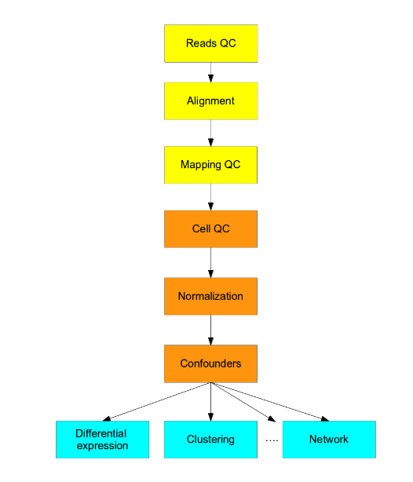

```{r setup, include=FALSE}
knitr::opts_chunk$set(echo = TRUE, message = FALSE, warning = FALSE)
```

## Lab3 - Single cell RNA seq (scRNA-seq)

Today, it's possible to get genomic information from single cells. (You should have heard about single cell RNA-seq in the lectures!). Traditionally, many of the methods used to analyze RNA-seq data were developed with standard "bulk" RNA-seq in mind. However, some of the underlying assumptions that are used for "bulk" RNA-seq methods are not appropriate for analyzing scRNA-seq data.

## Intro

Short recap: what is scRNA-seq?

- Measures the distribution of expression levels for each gene across a population of cells.
- Allows to study new biological questions in which cell-specific changes in transcriptome are important, e.g. cell type identification, heterogeneity of cell responses, stochasticity of gene expression, inference of gene regulatory networks across the cells.
- Currently there are several different protocols in use, e.g. SMART-seq2, CELL-seq and Drop-seq.
- There are also commercial platforms available, including the Fluidigm C1, 10X Genomics Chromium etc.
- Several computational analysis methods from bulk RNA-seq can be used.
- In most cases computational analysis requires adaptation of the existing methods or development of new ones.

This is a general pipeline for an scRNA-seq analysis workflow



There are some specific challenges associated with single cell data. In particular, this data is often affected by what is known as **gene "dropouts"** (missing genes).
In bulk sequencing, dropouts are less common because of higher sequencing depth and the fact that transcriptional differences between cells are averaged out over many cells and cell types.

## Construct the expression matrix

Ok, let's start by looking at our expression matrix. Note that in the workflow schematic above, we will skip the Read QC, Alignment, Mapping QC, and Cell QC steps. Let's assume this (boring ;-)) stuff has already been done.

So, we have provided you with an already quality-controlled dataset, consisting of pluripotent stem cells. Load the data!

```{r, eval=FALSE}
data <- read.table("tung/reads.txt")
```

### Seurat

We will use the "Seurat" workflow, developed by the Satija Lab https://satijalab.org/ over at NYU. We use this as it's currently the best (imo) performing workflow for single cell data, which included specific normalization and transformation procedures that cope with the characteristics of single cell data.

Do you remember the "SummarizedExperiment" from lab1? Here we will work with a "Seurat" object, and interacting with the object is quite similar in the sense that all information about the samples can be stored within the object.

Load the package (install via BiocManager::install() if not already installed)

```{r, eval=FALSE}
library(Seurat)
```

Let's create a Seurat object with our counts:

```{r, eval=FALSE}
se <- CreateSeuratObject(counts = data)
```

How many genes do we have? How many cells?

```{r, eval=FALSE, echo=TRUE}
# Write your code / answer here
```

```{r, eval=FALSE, echo=FALSE}
#Facit
#19027 genes
#864 cells
```

Single-cell data typically contains _a lot_ of "samples" (cells).
Due to the size of the count matrix and the high frequency of dropouts, Seurat stores the data in a sparse matrix format.
You can access the counts by typing:

```{r, eval=FALSE}
se@assays$RNA[,]
```

Notice how it looks. If you want to read out the full matrix (which could be needed for mathematical calculations), type:

```{r, eval=FALSE}
as.matrix(se@assays$RNA[1:10, 1:10])
```

OBS! Notice how I only print out the first 10 genes and the first 10 samples to avoid having to display the whole matrix.

## QC

Now, not all cells might be "good", in the sense that we could have only very little data (RNA "reads") from some of them, and to not impact our analysis such "bad samples" can be removed.
It's usually a good idea to start to explore our data visually.

### Total number of reads obtained

We will use a histogram for this. To demonstrate, look at this example data:

```{r, eval=FALSE, echo=TRUE}
Temperature <- airquality$Temp
hist(Temperature)
```

By providing a vector of numbers, it's easy to plot the histogram. We can add e.g. vertical lines to specify cut-off points:

```{r, eval=FALSE, echo=TRUE}
hist(Temperature)
abline(v = 73, col = "red")
```

Make a histogram of the total number of RNA molecules detected per sample.
Based on prior experience working with scRNA-seq data and the shape of the distribution, you decide that you will use a filtering threshold of 1 million reads.
Include a vertical line in your figure to indicate this threshold.

Hint: in the RStudio console, type the name of your Seurat object (e.g. "se") and then $, you will see some saved data vectors named "nCount_RNA" and "nFeature_RNA".

```{r, eval=FALSE, echo=TRUE}
# Write your code / answer here
```

```{r, eval=FALSE, echo=FALSE}
#FACIT
hist(
    se$nCount_RNA,
    breaks = 100
)
abline(v = 1000000, col = "red")

```


### Nr of unique genes detected

In addition to ensuring a sufficient sequencing depth for each sample, we also want to make sure that the reads are distributed across the transcriptome. Make the same kind of histogram as before, now instead showing the distribution of the number of genes detected within each sample.
This time, you decide to use a filtering threshold of 7000 genes.
Include this threshold as a vertical line in your figure.

```{r, eval=FALSE, echo=TRUE}
# Write your code / answer here
```

```{r, eval=FALSE, echo=FALSE}
# FACIT
hist(
    se$nFeature_RNA,
    breaks = 100
)
abline(v = 7000, col = "red")
```

## Filter

Let's filter away the cells that fall below the thresholds from the previous questions, i.e. with less than 1 million reads or less than 7 thousand unique genes.

Hint: You can use the function `subset` on the Seurat object to select which cells to keep!

```{r, eval=FALSE, echo=TRUE}
# Write your code / answer here
```

```{r, eval=FALSE, echo=FALSE}
# FACIT
se2 <- subset(se, subset = nCount_RNA > 1000000 & nFeature_RNA > 7000)
```

Let's also remove the genes that are too lowly expressed across our cells. Remove those with a total count value < 500.

Hint: Instead of using the `subset` function, try to find the genes to keep with the `rowSums()` function and index the Seurat object using square brackets (`[`)!

```{r, eval=FALSE, echo=TRUE}
# Write your code / answer here
```


```{r, eval=FALSE, echo=FALSE}
#FACIT
subset <- rowSums(as.matrix(se@assays$RNA[,])) > 500
se <- se[subset, ]
```


How many cells do we have now? How many genes?

```{r, eval=FALSE, echo=TRUE}
# Write your code / answer here
```

```{r, eval=FALSE, echo=FALSE}
#FACIT

#14047 genes, 714 cells
```

## Normalization

As with many things when dealing with single cell data, due to the sparsity of the obtained data, it can be especially challenging to find proper methods for normalization. Examples include to first try to cluster the cells according to similarity, and then normalize groups of cells separately. However, here, we will use the SCTransform workflow (https://www.biorxiv.org/content/10.1101/576827v2) provided in the Seurat package:

```{r, eval=FALSE}
se <- SCTransform(se)
```

Now, you will have a new assay stored in the Seurat object: `se@assays$SCT`, which contains the transformed values.
The SCT assay will also be set as the "active" assay, meaning that it will be used by default in the methods that you apply to your Seurat object (this is, for example, the case with the `RunPCA` function, which we will use below).

## Exploratory visualization

PCA is a dimensionality reduction technique used to visualize high dimensional datasets.
Let's visualize our data in two dimensions with PCA. Seurat includes a number of functions to run dimensionality reductions, they are named `RunPCA()`, `RunICA()`, `RunTSNE()` etc.


```{r, eval=FALSE}
se <- RunPCA(se)
```

We can then plot the transformed data by using the function `DimPlot()` and specify the reduction that we want to use:

```{r, eval=FALSE}
DimPlot(se, reduction="pca")
```

Now, we are missing some metadata here. But looking at the colnames of our object, we notice that there are actually information here that we want to use to group the data with:

```{r, eval=FALSE}
colnames(se)[1:10]
```

For example, "NA19098" is the individual and "r1" is the replicate. We can split the strings and add this data to the meta data slot in the Seurat object:

```{r, eval=FALSE}
se@meta.data$individual  <- sapply(strsplit(colnames(se), "[.]"), "[[", 1)
se@meta.data$replicate <- sapply(strsplit(colnames(se), "[.]"), "[[", 2)
```

The metadata can be used to annotate the plots produced by `DimPlot`.
Produce a PCA plot where data points have been colored by "individual" and shaped by "replicate".

Hint: Read the help text on `DimPlot()` and, specifically, the "shape.by" and "group.by" arguments!

```{r, eval=FALSE}
# Write your code / answer here
```

```{r, echo=FALSE, eval=FALSE}
#FACIT
DimPlot(se, reduction="pca", group.by="individual")
se <- RunTSNE(se)
DimPlot(se, reduction="tsne", group.by="individual")
```


Try some other dimensionality reduction methods and play around with coloring the cells, can you draw any conclusion from the data?

```{r, eval=FALSE}
# Write your code / answer here
```

## Clustering

Let's cluster our data!

For this, we will use k-means, which is a standard approach to clustering.
K-means partitions the data by assigning each data point to the closest cluster center.
The k-means algorithm is non-deterministic.
This means that we may get a different outcome each time we run it.
To avoid non-determinism, we will make use of the R function `set.seed()`, which allows us to re-run random processes with the same outcome every time (given that we put the same number inside the set.seed function).

```{r, eval=FALSE}
set.seed(101)
```

Use the function `kmeans()` to cluster your cells into 5 different clusters and save the output as an object called "km".
Use the parameters `iter.max=10` and `nstart=10`  in your call to `kmeans`.

Hint: Make sure that the dimensions of the count data has the right order so that you cluster the samples and not the genes. You may have to transpose the count matrix first!

```{r, eval=FALSE}
# Write your code / answer here
```

```{r, eval=FALSE, echo=FALSE}
#FACIT
set.seed(101)
km <- kmeans(t(as.matrix(se@assays$SCT[,])), iter.max=10, nstart=10, centers=5)
```

Now, we can color our data according to the cluster assignments. First, we store the cluster info in the meta data slot.

```{r, eval=FALSE}
se@meta.data$cluster <- km$cluster
```

Produce a new PCA plot and color the data points by their cluster annotation!

```{r, eval=FALSE, echo=FALSE}
# Write your code / answer here
```

```{r, eval=FALSE, echo=FALSE}
#FACIT
DimPlot(se, reduction="pca", group.by="cluster")
DimPlot(se, reduction="tsne", group.by="cluster")
```

Does this result surprise you or do the clusters make sense? Why/Why not? Explain your reasoning!

```{r, eval=FALSE}
# Write your answer here
```
