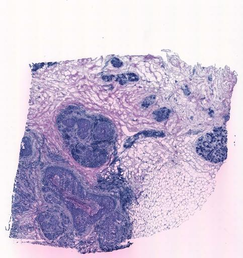

```{r setup, include=FALSE}
knitr::opts_chunk$set(echo = TRUE, eval=FALSE, message = FALSE, warning = FALSE)
```

# Lab4 - Spatial Transcriptomics

## Intro

In this lab we will look at Spatial Transcriptomics (ST) data.

The dataset that we will work with is a real example of a Breast Cancer tissue biopsy. By studying the histology image together with the RNA-seq data, we will be able to characterize the transcriptome of distinct regions in the biopsy. This is the tissue section that we will work with:



If you aren't a pathologist (I sure ain't!), a histology image by itself might not tell you much. Nevertheless, in this particular case, it's fairly easy to see where the tumor areas are. Traditionally, if one was to use "bulk" RNA-seq (i.e. take RNA from the whole tissue section), there would be no distinction of different tumor areas, as they would be mixed together.

## Load the data

As in lab 3, we will use the Seurat package to store our data. Start by downloading the count data and the tissue image from Canvas, and load the count data into R using `read.table`:

```{r}
# Write your code here
```

```{r, echo=FALSE}
#FACIT
data <- read.table("data_lab4/counts.tsv", check.names = FALSE)
```


Let's look at our column-names here. In previous labs, columns represented "samples" or "cells". Here, they represent a spatial "spot", i.e. a circular area on the array where the RNA molecules were captured. Look at some of the column names. You will notice that they are in the form of coordinates ([x-coordinate]x[y-coordinate]), representing the position of the spot on the ST array. This information can be used to plot the data in R, which we will do shortly.

## Filter out low abundance genes.

There are quite a lot of genes here with very low count values across the tissue. These will be both hard to analyze due to their sparsity and increase the computational time of our analyses. So let's filter them out. Set a threshold so that remaining genes have a sum total of at least 10 reads across all spots.

```{r}
# Write your code here
```

```{r, echo=FALSE}
#FACIT
data <- data[rowSums(data) >= 10, ]
```

## Create the Seurat object

ST data does not have single cell resolution (although there is a big research push trying to get there!). Instead, one spatial "spot" contains roughly 10 cells on average. However, the characteristics of the data are in many ways similar to those of single cell assays. Hence, many of the methods that we use to deal with ST data in our lab are methods that originally were developed for single cell data (the Seurat workflow that we will be using here is one example).

Let's create a Seurat object for our data.

```{r}
# Write your code here
```

```{r, echo=FALSE}
#FACIT
library(Seurat)
se <- CreateSeuratObject(counts = data)
```


### Spot filtering

We also want to remove spots with too few reads. Filter out all spots with less than 500 reads across all genes (using, for example, the `subset` function).

```{r}
# Write your code here
```

```{r, echo=FALSE}
#Facit
se <- subset(se, subset = nCount_RNA >= 500)
```


After the filtering steps, you should be left with 9898 genes and 606 spots.
Make sure that this is the case before proceeding!

```{r, echo=FALSE}
#Facit
se
```

## Normalize the data

Just as we did in lab 3, normalize the data using `SCTransform`:

```{r}
# Write your code here
```

```{r, echo=FALSE}
#FACIT
se <- SCTransform(se)
```

## Plot the data

As we have seen, the spatial coordinates are saved as column names in the count file. These can be extracted and used as coordinates for our plots. I've provided some code below to do this. You can use my code or try it yourself! (It's not really needed to understand this code if you don't want to ;))

Basically, I extract the x and y coordinates and create a data frame with them that I use for plotting:

```{r}
spotNames <- colnames(se)
spotNames <- sapply(strsplit(spotNames, "_"), "[[", 1)
xcoord = as.numeric(sapply(strsplit(spotNames, "x"), "[[", 1))
ycoord = as.numeric(sapply(strsplit(spotNames, "x"), "[[", 2))
coord_df = as.data.frame(cbind(x=xcoord, y=ycoord))

plot(x=xcoord, y=-ycoord, col="black", lwd=5, asp=1,
             ylab="", xlab="", main=paste("Tissue plot"), pch=7, cex.main=3,
             xaxt="n", yaxt="n", bty="n", col.main="black")
```

Do you recognize the shape of the points?

```{r}
# Write your answer here -- What are we looking at? Why are there holes in the plot?
```

```{r, echo=FALSE}
#Spots that passed the filtering is shown
```


### Spatially variable genes

Let's explore what we can actually do with the fact that we have spatial information alongside our gene expression data.

Begin by finding the most variable genes in your data across the spots (hint: use `var()` and apply it to all rows).
Note: Make sure that you are using the normalized/transformed data and not the raw counts!

```{r}
# Write your code here -- Create a vector of gene names sorted by their variance in the dataset and print out the five most variable genes
```


```{r, echo=FALSE}
#FACIT
var_genes <- sort(apply(GetAssayData(se), 1, var), decreasing = T)
head(var_genes)
```

### Spatial gene plots

In order to make a color gradient, we can use the function `colorRampPalette` and set the color range between two colors (low and high). First, extract the normalized counts of your _4th most variable gene_ and store them as a vector.

```{r}
# Write your code here -- Extract the normalized counts of your 4th most variable gene. Assign them to a variable named "col".
```


```{r, echo=FALSE}
#FACIT
gene <- names(var_genes)[4]
col <- GetAssayData(se)[gene,]
```

Then, we will use this vector to create our color gradient (I've given you the code below):

```{r}
rbPal <- colorRampPalette(c('yellow','red'))
color_vector <- rbPal(10)[as.numeric(cut(col, breaks = 10))]
```

Now, we can do the same plot as before, but instead color the points with the color vector!
Also, put the name of the gene as the main title of the plot!

```{r}
# Write your code here
```

```{r, echo=FALSE}
plot(x=xcoord, y=-ycoord, col=color_vector, lwd=5, asp=1,
             ylab="", xlab="", main=paste(gene), pch=7, cex.main=3,
             xaxt="n", yaxt="n", bty="n", col.main="black")
```

### Plot the data with the tissue image

One of the main advantages of ST data is that you can overlay the expression data on the tissue image. Below I have given you a function for such a plot. Load the function in R (i.e. just copy and run the code), and run the function with your data and your image file (downloaded from canvas and loaded into R (see next chunk)). OBS: you might need to install the `ggplot2` library first (and load it)

```{r}
#This is the code to load the image.
#OBS! You need the "jpeg" package, install if you do not have that!
library(jpeg)
library(ggplot2)
tissue <- jpeg::readJPEG("data_lab4/he_image.jpg")
tissue_grob <- grid::rasterGrob(tissue,
                                    width = unit(1, "npc"),
                                    height = unit(1, "npc"),
                                    interpolate = TRUE
                                )
```

Load the plotting function:

```{r}
arrayPlot <- function(coordinates, image) {
    xmin=1
    xmax=33
    ymin=1
    ymax=35

    annotation <- ggplot2::annotation_custom(image, -Inf, Inf, -Inf, Inf)

    coordinates$y <- ymax - coordinates$y + ymin

    ggplot(data=coordinates, aes(x=x, y=y)) +
       annotation +
        geom_point(col="black", alpha = 0.5, size=8) +
        coord_fixed() +
        scale_x_continuous(expand = c(0, 0), limits = c(xmin, xmax)) +
        scale_y_continuous(expand = c(0, 0), limits = c(ymin, ymax)) +
        theme_bw() +
        theme(
            axis.text = element_blank(),
            axis.title = element_blank(),
            axis.ticks = element_blank()
        )
}
```

To plot the data, call the `arrayPlot` function like this:

``` {r, fig.height=12, fig.width=12}
arrayPlot(coord_df, image=tissue_grob)
```

Modify `arrayPlot` to color the spots based on the `color_vector` that you created before and plot the results. Explain what you see! Where in the tissue does the gene appear to be expressed the most?

``` {r, fig.height=12, fig.width=12}
# Write your code and answer here
```

```{r, echo=FALSE}
#FACIT
coloredArrayPlot <- function(coordinates, image, col) {
    xmin=1
    xmax=33
    ymin=1
    ymax=35

    annotation <- ggplot2::annotation_custom(image, -Inf, Inf, -Inf, Inf)

    coordinates$y <- ymax - coordinates$y + ymin

    ggplot(data=coordinates, aes(x=x, y=y)) +
       annotation +
        geom_point(col=col, alpha = 0.5, size=8) +
        coord_fixed() +
        scale_x_continuous(expand = c(0, 0), limits = c(xmin, xmax)) +
        scale_y_continuous(expand = c(0, 0), limits = c(ymin, ymax)) +
        theme_bw() +
        theme(
            axis.text = element_blank(),
            axis.title = element_blank(),
            axis.ticks = element_blank()
        )
}
```

```{r, fig.height=12, fig.width=12, echo=FALSE}
#FACIT
#Red = High counts
coloredArrayPlot(coord_df, image=tissue_grob, col=color_vector)
```


## Cluster the data

Let's cluster the spots with k-means and visualize the clusters on the array.
Begin by clustering the spots into 5 clusters.

```{r}
# Write your code here -- Run k-means on the normalized count values
```

```{r, echo=FALSE}
#FACIT
set.seed(101)
km <- kmeans(t(as.matrix(se@assays$SCT[,])), iter.max=10, nstart=10, centers=5)
```

Remember that cluster labels are stored as an attribute in the output object (e.g. if you type `km <- kmeans(...)`, they are found in km$cluster).

In order to create a color palette for the cluster labels, we will use the command `palette()[km$cluster]`.
After running this, you might as well save the color information to the Seurat object, e.g:

```{r}
se@meta.data$clusterColor <- palette()[km$cluster]
```

Make an array plot and color the spots by their cluster labels!

```{r, echo=FALSE}
# Write your code here
```

```{r, fig.height=12, fig.width=12, echo=FALSE}
#FACIT
arrayPlot <- function(coordinates, image) {
    xmin=1
    xmax=33
    ymin=1
    ymax=35

    annotation <- ggplot2::annotation_custom(image, -Inf, Inf, -Inf, Inf)

    coordinates$y <- ymax - coordinates$y + ymin

    ggplot(data=coordinates, aes(x=x, y=y)) +
       annotation +
        geom_point(col=se$clusterColor, alpha = 0.3, size=8) +
        coord_fixed() +
        scale_x_continuous(expand = c(0, 0), limits = c(xmin, xmax)) +
        scale_y_continuous(expand = c(0, 0), limits = c(ymin, ymax)) +
        theme_bw() +
        theme(
            axis.text = element_blank(),
            axis.title = element_blank(),
            axis.ticks = element_blank()
        )
}

arrayPlot(coord_df, image=tissue_grob)
```

## Expression differences between regions

Let's conduct a _differential gene expression analysis_ between two areas. We can do this in Seurat with the `FindMarkers` function. To use this function, we first need to save the cluster assignments as "Idents" in the Seurat object:

```{r, eval=FALSE}
Idents(object = se) <- se@meta.data$clusterColor
```

The function can then be used like this:

`FindMarkers(se, ident.1 = "green", ident.2 = "black")`

Now run a differential expression analysis between the tumor area (hint: one of several tumor areas are in the middle of the tissue) and the non-tumor area located at the far right of the tissue (which is cell dense) with the FindMarkers function.

```{r}
# Write your code here -- Run a DEA between the tumor area and the cell dense, non-tumor area located at the far right of the tissue
```

```{r, eval=FALSE, echo=FALSE}
#FACIT
res <- FindMarkers(se, ident.1 = "red", ident.2 = "black")
```

You will get a table with p-values and average log-fold changes.

### Extract the top 5 up-regulated genes in the tumor area

Sort the table from the previous question by the adjusted p-values and print the top 5 most significantly differentially expressed genes.

```{r}
# Write your code and answer here -- Print the 5 most significant differentially expressed genes
```

```{r, eval=FALSE, echo=FALSE}
#FACIT
most_diff <- res[order(res$p_val_adj), ]
head(most_diff, n=5)
```

Choose a gene that you think is "cancer-associated" and make an array plot showing the expression of that gene.
Does the expression pattern make sense?

```{r}
# Write your code and answer here
```
